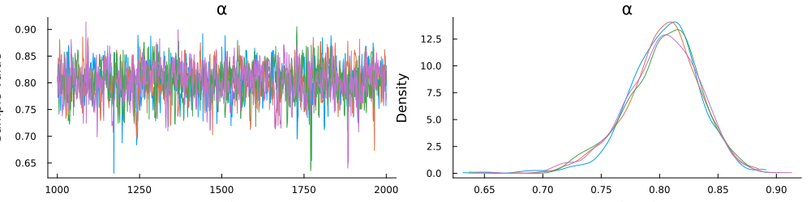

# Parameter Estimation

In this brief tutorial, we will demonstrate how to perform Bayesian parameter estimation using [Turing.jl](https://turinglang.org/docs/tutorials/docs-00-getting-started/index.html). For simplicity, we will estimate the utility curvature parameter of an expected utility model from 50 independent identically distributed observations from a single choice set. 

## Load Packages
The first step is to load the required packages.

```julia
using Plots
using Random
using Turing
using UtilityModels
Random.seed!(6541)
```
## Choice Set

Next, we will create the choice set from two trinary gambles. The first gamble is less risky than the second gamble, as defined by lower variance.
```julia
gamble1 = Gamble(; 
    p = [.25, .25, .50], 
    v = [44, 40, 5]
)
```
The second gamble is relatively more risky. 
```julia
gamble2 = Gamble(; 
    p = [.25, .25, .50], 
    v = [98, 10, 5]
)
```
In the code block below, we combine the gambles into a vector representing the available options. In addition, we create a model object and generate 50 simulated choices. The gambles and simulated choices are combined into a single data structure so it can be passed to `logpdf` via Turing and subsequently parsed. 
```julia
gambles = [gamble1,gamble2]
eu_model = ExpectedUtility(; α = .80, θ = 1)
choices  = rand(eu_model, gambles, 50)
data = (gambles,choices)
```
## Create Turing Model
Below, we create a turing model by prefixing a function with the `@model` macro. The function passes the data and defines two sampling statements: a prior distribution on the utlity curvature parameter, and a sampling statement for the data.
```julia
@model function model(data)
    α ~ truncated(Normal(.8, 1), 0, Inf)
    data ~ ExpectedUtility(; α, θ = 1)
end
```

## Estimate Parameters
Now that the Turing model has been defined, we can pass it, along with the data, to `sample` to perform Bayesian parameter estimation with an MCMC algorithm called the No-U-turn sampler. The function call below will sample 2,000 times from the posterior distribution (discarding the first 1,000 warmup samples), for 4 parallel chains.
```julia
chain = sample(model(data), NUTS(1000, .85), MCMCThreads(), 1000, 4)
```
```julia 
┌ Info: Found initial step size
└   ϵ = 0.0125
┌ Info: Found initial step size
└   ϵ = 0.025
┌ Info: Found initial step size
└   ϵ = 0.00625
┌ Info: Found initial step size
└   ϵ = 3.2
Chains MCMC chain (1000×13×4 Array{Float64, 3}):

Iterations        = 1001:1:2000
Number of chains  = 4
Samples per chain = 1000
Wall duration     = 0.91 seconds
Compute duration  = 3.03 seconds
parameters        = α
internals         = lp, n_steps, is_accept, acceptance_rate, log_density, hamiltonian_energy, hamiltonian_energy_error, max_hamiltonian_energy_error, tree_depth, numerical_error, step_size, nom_step_size

Summary Statistics
  parameters      mean       std      mcse    ess_bulk    ess_tail      rhat   ess_per_sec 
      Symbol   Float64   Float64   Float64     Float64     Float64   Float64       Float64 

           α    0.8031    0.0317    0.0009   1299.4792   1501.7839    1.0008      428.8710

Quantiles
  parameters      2.5%     25.0%     50.0%     75.0%     97.5% 
      Symbol   Float64   Float64   Float64   Float64   Float64 

           α    0.7346    0.7841    0.8055    0.8240    0.8591
```

## Plot Posterior Distribution
Inspection of the trace plot does not reveal any anomolies. The density plot shows that the posterior distribution is centered near the data generating value of $\alpha = .80$ and spans roughtly between .75 and .85, suggesting good recovery of the parameter. 

```julia
plot(chain, grid = false)
```
